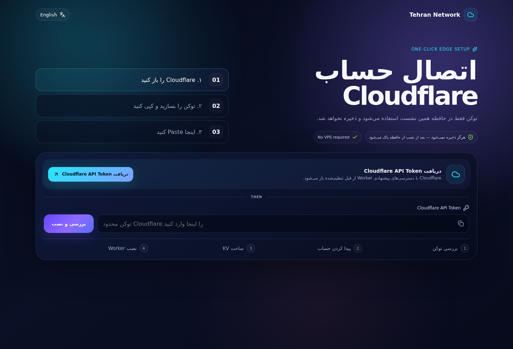
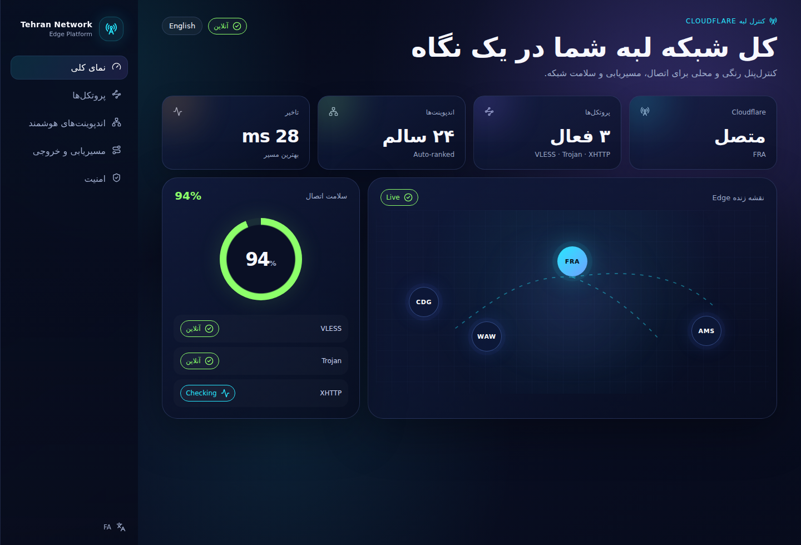
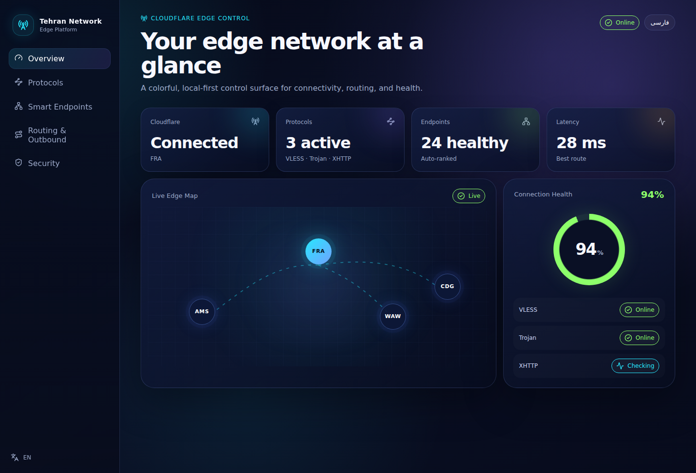

<div align="center">

# Tehran Network Edge Panel

**پنل Serverless رنگی و دو زبانه برای Cloudflare Workers — بدون VPS شخصی**
**A colorful bilingual serverless edge panel for Cloudflare Workers — no personal VPS required**

[فارسی](#فارسی) · [English](#english) · [Security](SECURITY.md) · [Roadmap](#نقشه-راه--roadmap)


### 🚀 نصب / Install

**Install Free on Cloudflare — نصب رایگان، بدون ترمینال، بدون GitHub و بدون Deploy دستی**

[](https://tehran-network-installer.honored-feather.workers.dev)

**۳ قدم تا پنل — 3 steps to your panel:**

| گام | کار شما                                                                   |
| --- | ------------------------------------------------------------------------- |
| ۱   | دکمهٔ **Install Free on Cloudflare** را بزنید؛ Installer آماده باز می‌شود |
| ۲   | **ساخت کلید Cloudflare / Generate Cloudflare Key** → Create Token → Copy  |
| ۳   | برگردید، Token را Paste کنید → **Install**                                |

تمام. Installer خودش Account، KV، Worker، Secret و `workers.dev` را می‌سازد و آدرس پنل + رمز مدیریت را تحویل می‌دهد.
Done. The installer provisions Account/KV/Worker/Secret/workers.dev and returns your panel URL + admin password.

**[راهنمای فارسی](docs/INSTALL_FA.md)** · **[English guide](docs/INSTALL_EN.md)**

<details>
<summary>روش‌های پیشرفته / Advanced & self-hosted alternatives</summary>

اگر می‌خواهید خود Installer را داخل اکانت خودتان میزبانی کنید / If you want to self-host the installer:

[Deploy Installer yourself](https://deploy.workers.cloudflare.com/?url=https://github.com/tehrannetwork021/FreePanel-VPN/tree/main/apps/installer-worker)

```powershell
# Windows PowerShell
irm https://cdn.jsdelivr.net/gh/tehrannetwork021/FreePanel-VPN@main/install.ps1 | iex
```

```bash
# Linux / macOS / WSL / Git Bash
curl -fsSL https://cdn.jsdelivr.net/gh/tehrannetwork021/FreePanel-VPN@main/install.sh -o install.sh && bash install.sh
```

</details>

Developer/advanced path: [](https://deploy.workers.cloudflare.com/?url=https://github.com/tehrannetwork021/FreePanel-VPN/tree/main/deploy/worker)

</div>

> [!IMPORTANT]
> **وضعیت فعلی:** نسخه `v0.2.0` با **نصب‌کنندهٔ رایگان مبتنی بر توکن Cloudflare** منتشر شد: کلید بساز → Paste کن → Worker، KV، Secret و workers.dev خودکار نصب می‌شوند. هسته‌های **VLESS-WS، Trojan-WS و VLESS-XHTTP stream-one** با تست end-to-end واقعی فعال هستند.
> **Current status:** `v0.2.0` ships the **free Cloudflare token installer**: generate the key, paste it, and the Worker, KV, secret and workers.dev are provisioned automatically. **VLESS-WS, Trojan-WS and VLESS-XHTTP stream-one** are verified end-to-end.



## فارسی

### پروژه چیست؟

Tehran Network Edge Panel تجربه‌ی «کپی اسکریپت و تنظیم دستی KV/Worker» را به یک نصب رایگان و خودکار تبدیل می‌کند. کافی است یک توکن محدود Cloudflare بسازید و به نصب‌کننده بدهید؛ بقیهٔ کار — ساخت KV، آپلود Worker امضاشده، ست‌کردن رمز مدیریت و فعال‌سازی `workers.dev` — در چند ثانیه و داخل اکانت خودتان انجام می‌شود. مسیر پیشرفتهٔ Deploy-to-Cloudflare برای توسعه‌دهندگان جداگانه باقی مانده است.

### نصب برای کاربر عادی

**فقط همین لینک را باز کنید:** [https://tehran-network-installer.honored-feather.workers.dev](https://tehran-network-installer.honored-feather.workers.dev)

1. Installer آماده باز می‌شود؛ نه GitHub account لازم دارید، نه Deploy Installer، نه Wrangler و نه ترمینال.
2. روی **ساخت کلید Cloudflare** بزنید. صفحهٔ رسمی Cloudflare با دسترسی‌های لازم باز می‌شود: Workers Scripts Edit، Workers KV Storage Edit و Account Settings Read.
3. **Create Token** را بزنید و Token را کپی کنید.
4. به Installer برگردید، Token را Paste و Verify کنید. اگر چند Account دارید یکی را انتخاب کنید؛ نام Worker و رمز مدیریت هم قابل تغییر است و رمز پیش‌فرض خودکار ساخته می‌شود.
5. **Install** را بزنید. KV + Worker + Secret + workers.dev به‌صورت خودکار داخل اکانت خودتان ساخته می‌شود.
6. آدرس پنل و رمز مدیریت را بردارید و وارد پنل شوید.

Token فقط برای همین درخواست نصب از طریق HTTPS به Installer Worker ارسال می‌شود، در KV/DB/Cookie/localStorage/log ذخیره نمی‌شود و بعد از تلاش نصب پاک می‌شود. پنل نهایی هیچ وابستگی‌ای به Installer ندارد و می‌توانید Token نصب را بعداً از Cloudflare حذف کنید.

**راه جایگزین برای کاربران فنی:** اسکریپت ترمینال و Self-hosted Installer داخل بخش Advanced بالای README باقی مانده‌اند.

راهنمای گام‌به‌گام: [آموزش کامل فارسی](docs/INSTALL_FA.md)

### چرا متفاوت است؟

- **رایگان و بدون سرور:** همه‌چیز روی پلن رایگان Cloudflare و داخل اکانت خود شما ساخته می‌شود؛ نه VPS می‌خواهد نه دامنه.
- **Token کم‌عمر و بدون ذخیره‌سازی:** Token فقط برای درخواست نصب روی Installer Worker استفاده می‌شود، هیچ‌جا persist نمی‌شود و بعد از هر تلاش پاک می‌شود.
- **فارسی واقعی + English:** RTL/LTR در تست‌های Unit و Browser کنترل می‌شود.
- **ظاهر اختصاصی:** Prismatic Network Console به‌جای Dashboard templateهای تکراری.
- **Responsive:** تست خودکار در عرض موبایل و Desktop انجام می‌شود.
- **کد ماژولار:** UI، i18n، Installer و Worker از هم جدا هستند.
- **Security-first:** Artifact نصب‌شده SHA-256 امضادار است و Secretها از هم جدا طراحی می‌شوند.

### داشبورد فارسی



### Dashboard انگلیسی



### نصب سریع

**برای کاربر عادی هیچ ابزار توسعه‌ای لازم نیست.**

1. [https://tehran-network-installer.honored-feather.workers.dev](https://tehran-network-installer.honored-feather.workers.dev) را باز کنید.
2. Generate Key → Create Token → Copy → Paste.
3. Install را بزنید و آدرس `*.workers.dev` پنل خود را بگیرید.

آموزش کامل: [docs/INSTALL_FA.md](docs/INSTALL_FA.md)

برای توسعه محلی UI، [docs/QUICKSTART_FA.md](docs/QUICKSTART_FA.md) را ببینید.

### تست‌ها

```bash
pnpm check
pnpm test:e2e
```

CI همین Quality Gateها را در Pull Request اجرا می‌کند.

## English

### What is it?

Tehran Network Edge Panel turns "copy a script and wire KV/Worker by hand" into a free, automated installation. Create a narrowly scoped Cloudflare token, paste it into the installer, and everything else — KV provisioning, signed Worker upload, admin secret and `workers.dev` enablement — happens inside your own account in seconds. The developer-focused Deploy-to-Cloudflare path remains as an advanced alternative.

### One-click installation

**Open the public installer:** [https://tehran-network-installer.honored-feather.workers.dev](https://tehran-network-installer.honored-feather.workers.dev)

1. The ready-to-use installer opens directly. No GitHub account, installer deployment, Wrangler or terminal is required.
2. Click **Generate Cloudflare Key**. Cloudflare opens the official token builder with Workers Scripts Edit, Workers KV Storage Edit and Account Settings Read.
3. Click **Create Token**, copy it, return to the installer and paste/verify it.
4. Pick an account if needed; the Worker name and auto-generated admin password remain editable.
5. Click **Install**. KV + Worker + secret + workers.dev are provisioned automatically inside your Cloudflare account.
6. Open the returned panel URL and keep the displayed admin password.

The token is sent over HTTPS to the installer Worker only for the current install request. It is never persisted to KV/database/cookies/browser storage/logs and is cleared after the attempt. The installed panel is independent from the public installer, so you may revoke the setup token afterwards.

**Technical alternatives:** terminal scripts and a self-hosted installer remain under the Advanced section at the top of this README.

Step-by-step guide: [English installation guide](docs/INSTALL_EN.md)

### Why this project?

- **Free and serverless** — everything runs on the Cloudflare Free plan inside your own account; no VPS, no custom domain.
- **Ephemeral install credential** — the token is used only for the current HTTPS install request, is never persisted, and is cleared after every attempt.
- **Persian + English** — tested RTL/LTR parity, not a translated afterthought.
- **Distinct visual system** — a colorful Prismatic Network Console instead of a generic admin template.
- **Responsive by test** — browser tests cover desktop and mobile layouts.
- **Modular codebase** — installer, dashboard, translations and worker core are isolated packages.
- **Security-oriented boundaries** — the deployed artifact is SHA-256 pinned and secrets are separated by concern.

### Quick start

**Regular users do not need local development tools.**

1. Open [https://tehran-network-installer.honored-feather.workers.dev](https://tehran-network-installer.honored-feather.workers.dev).
2. Generate Key → Create Token → Copy → Paste.
3. Click Install and receive your panel's `*.workers.dev` URL.

Full guide: [docs/INSTALL_EN.md](docs/INSTALL_EN.md)

For local UI development, see [docs/QUICKSTART_EN.md](docs/QUICKSTART_EN.md).

### Architecture

```text
apps/installer-worker → token-based provisioning Worker (KV + Worker + secret + workers.dev)
apps/installer        → free installer UI served by installer-worker
deploy/worker         → isolated panel Worker template (developer path)
apps/panel            → bilingual network dashboard
packages/ui           → Prismatic Network Console design primitives
packages/i18n         → Persian/English dictionaries + RTL/LTR rules
packages/shared       → product contracts shared across apps
```

## نقشه راه / Roadmap

| بخش / Area                          | وضعیت / Status    |
| ----------------------------------- | ----------------- |
| TypeScript monorepo + CI            | ✅ Ready          |
| Persian/English RTL/LTR             | ✅ Ready          |
| Responsive dashboard                | ✅ Ready          |
| Free Cloudflare token installer     | ✅ Ready          |
| Automatic KV/secret/workers.dev     | ✅ Ready          |
| Official Deploy to Cloudflare (dev) | ✅ Ready          |
| Volatile token handling             | ✅ Ready          |
| Worker rollback                     | 🚧 In development |
| VLESS-WS core                       | ✅ Ready          |
| Trojan-WS core                      | ✅ Ready          |
| VLESS-XHTTP stream-one              | 🧪 Field retest   |
| Smart endpoints / rotation          | 🧭 Planned        |
| Subscription + QR                   | ✅ Ready          |
| DNS / ECH / Network Lab             | 🧭 Planned        |

## امنیت / Security

اگر مشکل امنیتی پیدا کردید، Secret یا Token را داخل Issue عمومی قرار ندهید. قبل از گزارش، [SECURITY.md](SECURITY.md) را بخوانید.
If you find a security issue, never paste tokens or secrets into a public issue. Read [SECURITY.md](SECURITY.md) first.

## مشارکت / Contributing

PR و Issue خوش‌آمد است. قبل از تغییر بزرگ، [CONTRIBUTING.md](CONTRIBUTING.md) و [AGENTS.md](AGENTS.md) را بخوانید. AGENTS.md دفتر وضعیت پروژه است و فقط کار تست‌شده در آن تیک می‌خورد.

## License

MIT. پروژه‌های ثالثی که فقط به‌عنوان مرجع معماری بررسی شده‌اند در [THIRD_PARTY_NOTICES.md](THIRD_PARTY_NOTICES.md) فهرست شده‌اند.

---

<div align="center"><sub>Built by Tehran Network · Cloudflare Workers · Serverless · Persian RTL · Open Source</sub></div>
